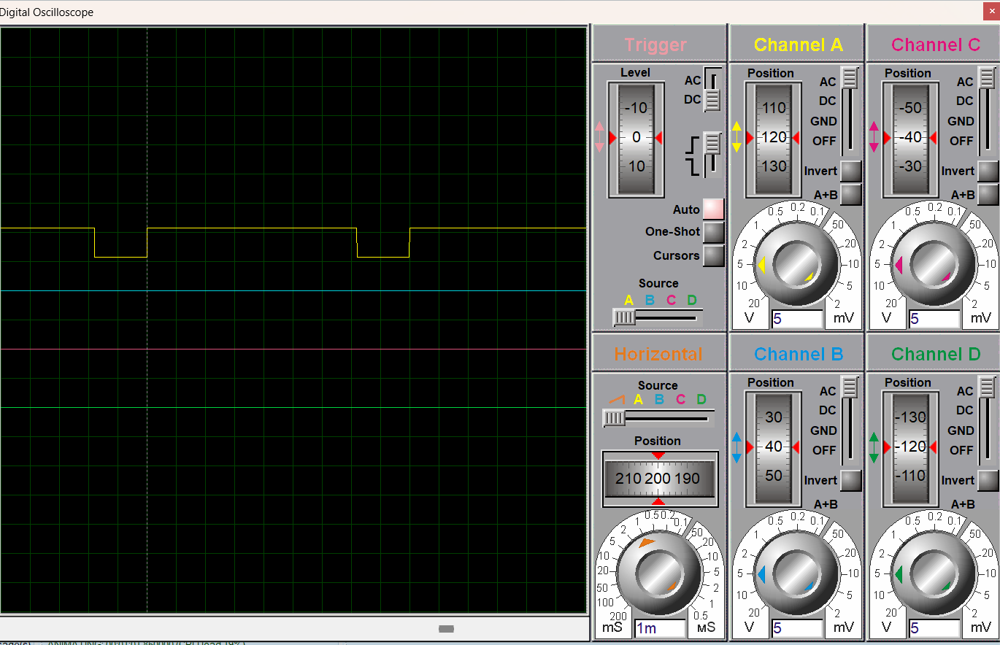

# << ## **STM32 & H-Bridge DC Motor Control** ## >>

***

### << ## **PROJECT SUMMARY** ## >>
***

** **This study is an STM32F103C8-based DC motor driver system developed with industrial-grade safety and control principles.**
** **The primary objective of the project is to provide solutions for high-level engineering challenges such as Dead-Time Management, Level Shifting, and Hardware Interlock.**
** **These features are critical for systems used in the defense industry and automotive sectors.**

---

### << ## **TECHNICAL SPECIFICATIONS** ## >>

** **Dynamic Speed Control (PWM):**
** **Motor speed is precisely controlled within a 0-100% duty cycle range using high-frequency signals generated via the STM32 Timer2 peripheral.**

** **Hardware Security (74HC08):**
** **A logical locking layer created with AND gates prevents simultaneous activation of both motor directions, even during software failure.**

** **Software Dead-Time:**
** **A 500ms safety delay is integrated into the algorithm to ensure transistors are fully turned off during direction changes.**
** **This mechanism specifically prevents "Shoot-through" currents.**

** **Isolated Power Stage (Level Shifter):**
** **3.3V microcontroller signals are transferred to the 12V power stage using BC237 transistors as level shifters.**
** **This provides an isolated and loss-free signal transmission.**

---

### << ## **HARDWARE INTERLOCK & SHOOT-THROUGH MITIGATION** ## >>

** **The most critical failure mode in an H-bridge is the "Shoot-through" phenomenon.**
** **This occurs when high-side and low-side transistors on the same bridge leg are activated simultaneously, creating a direct short circuit.**

** **In this architecture, the 74HC08 Quad AND Gates serve as a physical logic interlock layer.**
** **By cross-coupling the directional control signals, the system ensures the PWM drive signal is physically gated.**
** **Even if the STM32F103C8 outputs conflicting signals due to a software glitch, the hardware logic prevents a short-circuit state.**
** **This hardware-first safety approach ensures system integrity under all operating conditions.**

---

### << ## **TECHNICAL SPECTRUM** ## >>

#### << ## **Hardware Architecture** ## >>
** **Microcontroller:**
** **STM32F103C8T6 (ARM Cortex-M3).**

** **Power Transistors:**
** **TIP122 (NPN) and TIP127 (PNP) Darlington pairs.**

** **Driver Layer:**
** **BC237 NPN transistor-based level shifters.**

** **Logic Protection:**
** **74HC08 Quad AND Gates.**

** **Protection Elements:**
** **1N4007 Flyback diodes for Back-EMF protection.**

#### << ## **Software Architecture** ## >>
** **Development Environment:**
** **STM32CubeIDE.**

** **Library:**
** **STM32 HAL (Hardware Abstraction Layer).**

** **Algorithm:**
** **Sustainable code structure using modular Motor_Drive and Motor_Stop functions.**

---

### << ## **SIMULATION AND ANALYSIS** ## >>

** **The system has been comprehensively tested in the Proteus 8.13+ environment.**
** **Signal stability has been verified via a digital oscilloscope.**

** **Figure 1: Professional circuit schematic and logic protection layer.**

** **Figure 2: Signal analysis for 20% and 80% Duty Cycles.**

---

### << ## **FOLDER STRUCTURE** ## >>

** **/Firmware:**
** **Contains STM32CubeIDE source codes and the compiled .hex file.**

** **/Hardware:**
** **Contains the Proteus simulation project file (.pdsprj).**

---

### << ## **CONTACT** ## >>
** **Yunus Kunduz**
** **Necmettin Erbakan University - Electrical & Electronics Engineering (Junior)**
** **YouTube Channel:** [CozumLab](https://www.youtube.com/@CozumLab)
